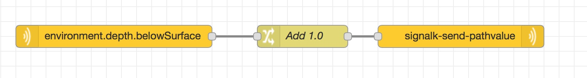
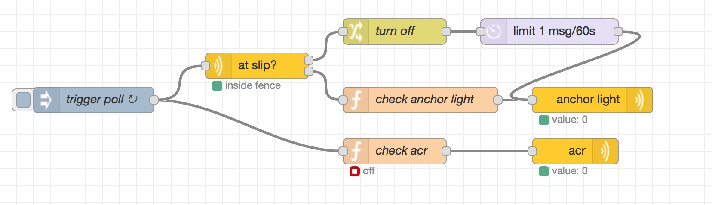
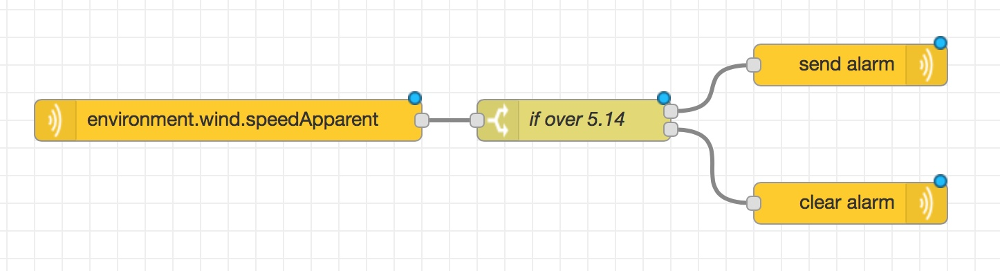

# node-red embedded examples by Ruslan K.

# Available Nodes

signalk-subscribe
signalk-input-handler
signalk-input-handler-next
signalk-geofence-switch
signalk-delay
signalk-send-pathvalue
signalk-geofence
signalk-put-handler
signalk-send-delta
signalk-send-put
signalk-send-notification